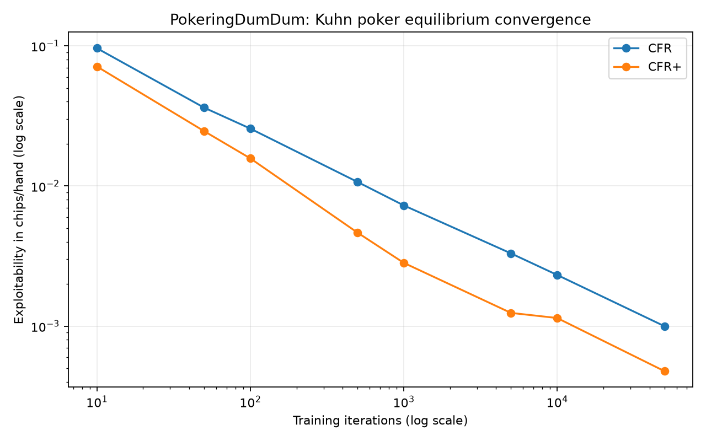

# PokeringDumDum 🃏

A not-so-dumb poker game-theory lab implementing **CFR** and **CFR+** for Kuhn
poker, with exact best responses and exploitability measurement.

## Why this project exists

Poker is a clean setting for studying decision-making under hidden information.
PokeringDumDum focuses on a result that can be verified: does the learned average
strategy approach a Nash equilibrium, and how quickly?

This is intentionally not a graphical poker game and not a claim of real-money
profitability. The research contribution is the solver, exact evaluation, tests,
and convergence study.

## What it includes

- explicit Kuhn poker rules and terminal utilities;
- full-tree vanilla CFR and CFR+;
- reach-weighted average strategies;
- exact expected-value and best-response enumeration;
- exploitability and NashConv metrics;
- deterministic tests and a reproducible convergence experiment.

## Run it

```bash
python -m pip install -e ".[dev]"
python -m pytest -q
python run_experiment.py
```

The experiment writes `data/convergence.csv`, `data/final_strategy.csv`, and
`docs/assets/convergence.png`. Generated tables are ignored because they can be
recreated; the figure is versioned so the result is visible on GitHub.



## Interpreting the result

Kuhn poker's equilibrium value for player zero is `-1/18` chips per hand. A sound
implementation should approach that value while exploitability trends toward zero.
Do not judge the solver from one displayed strategy probability: Kuhn poker has a
family of equilibria, so exact policy mixtures may differ while remaining sound.

Read [`docs/METHODOLOGY.md`](docs/METHODOLOGY.md) for the game rules, regret update,
exact best-response method, metric definitions, and limitations.
