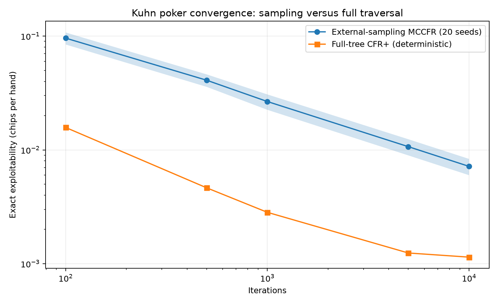

# External-sampling MCCFR results

## Recorded experiment

The study compares 20 seeded external-sampling MCCFR trajectories with one
deterministic full-tree CFR+ trajectory. Exploitability is evaluated exactly at
every checkpoint.

| Iterations | MCCFR mean exploitability | Approx. 95% interval | MCCFR mean time | CFR+ exploitability | CFR+ time |
| ---: | ---: | ---: | ---: | ---: | ---: |
| 100 | 0.09596 | [0.08433, 0.10759] | 0.041s | 0.01574 | 0.746s |
| 500 | 0.04095 | [0.03581, 0.04610] | 0.630s | 0.00464 | 1.015s |
| 1,000 | 0.02661 | [0.02250, 0.03072] | 1.180s | 0.00283 | 1.325s |
| 5,000 | 0.01068 | [0.00894, 0.01241] | 4.203s | 0.00124 | 3.552s |
| 10,000 | 0.00716 | [0.00599, 0.00833] | 7.748s | 0.00114 | 7.945s |

## Interpretation

External sampling improves substantially over its early policies, but full-tree
CFR+ is less exploitable at every matched iteration. At 10,000 iterations the
methods take roughly the same wall time on this run, while deterministic CFR+
has about one-sixth of the sampled method's mean exploitability.

This is not evidence against external sampling generally. Kuhn's complete tree
is tiny, so avoiding branches saves little work. Sampling adds variance and
random-number overhead without receiving its intended scaling benefit. The
experiment therefore supports a sharper next hypothesis: as the game tree grows,
does the reduction in nodes visited per iteration eventually compensate for the
sampled estimator's noise?

## Limitations

- Wall time depends on the machine, Python runtime, process warm-up, and load.
- The CFR+ comparator is deterministic, so it has no across-seed interval.
- Iterations are not equal computational units across the two algorithms.
- Normal confidence intervals from 20 seeds are approximate.
- The result concerns this implementation of Kuhn poker, not larger games.

The next experiment should port the same sampled traversal to Leduc poker, add
node-visit-normalized comparisons, and repeat the time-versus-exploitability
analysis without changing the Kuhn implementation after seeing Leduc results.
